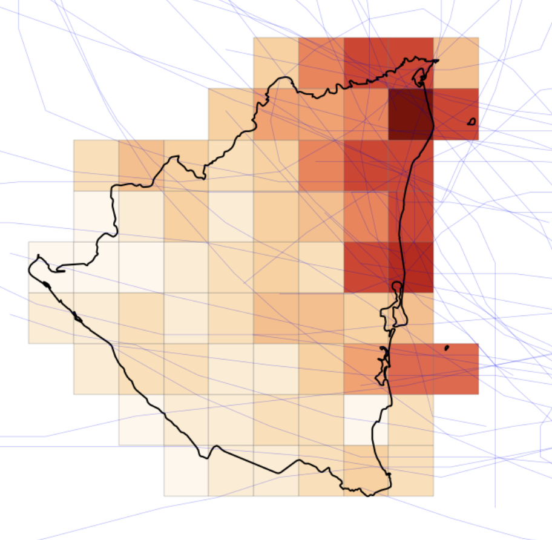
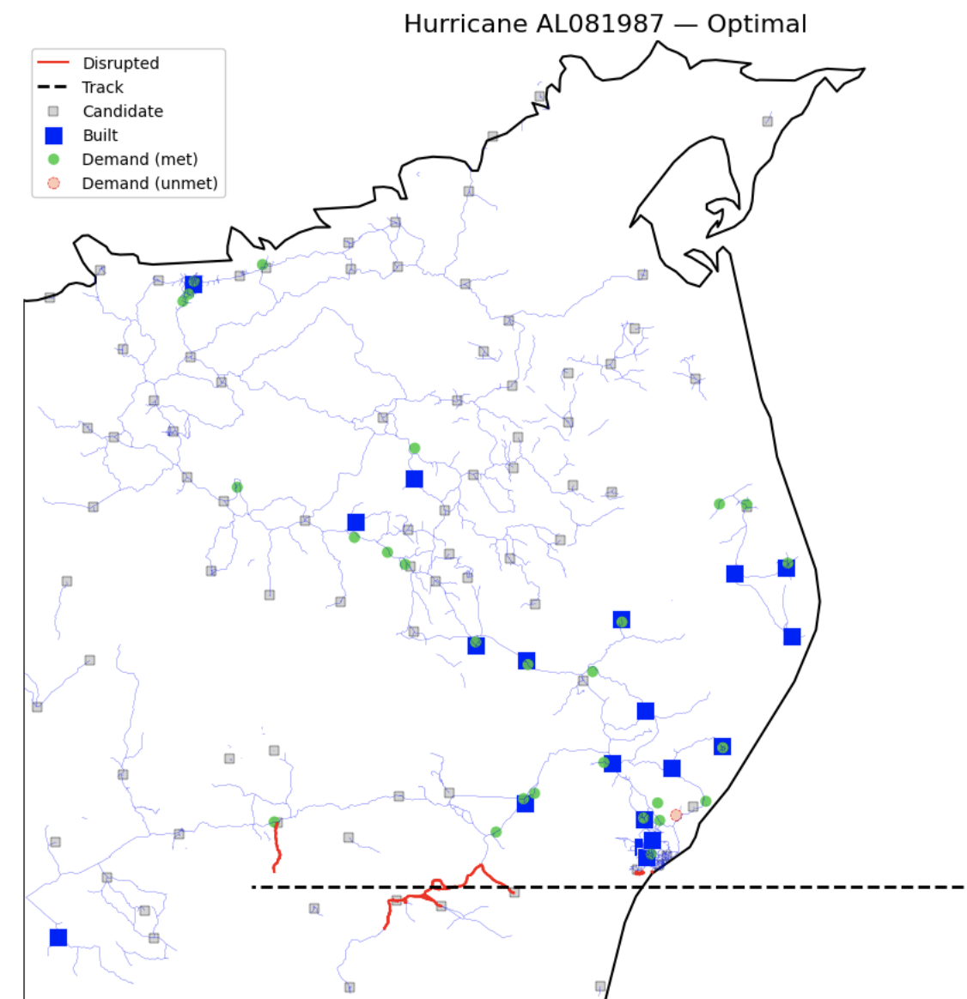

# Stochastic Benders Optimization for Hurricane Preparedness in Nicaragua

This repository contains the full pipeline and optimization code for a two-stage stochastic facility location model designed for hurricane preparedness in northeastern Nicaragua. The work is inspired by a collaboration with UNICEF, focusing on the pre-positioning of humanitarian relief supplies in anticipation of storm-related disruptions.

> 📘 This project was developed as part of **15.083 Integer Optimization** at **MIT**, taught by Prof. Alexandre Jacquillat.

  <em>Study area and spatial setup</em> 
  

## Overview

We use real data on:

* **Hurricane tracks** (HURDAT2 archive)
* **Road networks** (OpenStreetMap)
* **Population density** (WorldPop, 100m resolution)
* **Critical infrastructure** (e.g., schools, hospitals)

The objective is to decide where to open warehouses and how much inventory to pre-position in each, such that expected costs (including unmet demand penalties) are minimized across a range of historical hurricane scenarios.

This work applies a **stochastic optimization** framework, solved using **multi-cut Benders decomposition**. The approach supports fast evaluation and parallelization and demonstrates significant performance gains over naive and deterministic baselines.

## Model Summary

* **First stage**: Open warehouses and allocate pre-season stock.
* **Second stage**: After a hurricane scenario realization, route shipments to demand nodes.
* **Disruption model**: Roads within 10 km and warehouses within 5 km of a hurricane track are considered damaged.

## Key Results

* Stochastic planning reduces total cost by **26%** vs. a naive no-disruption baseline.
* Unmet demand drops by **27%**.
* Recency-weighted planners (e.g., exponential) outperform uniform weighting.
* Benders decomposition scales well and outperforms full-MIP on large instances.

  <em>Time-series Cross-validation results across five planning strategies</em> 
  

  <em>Example of strategy and performance under a hurricane scenario</em> 
  

## Citation

* Landsea, C. *et al.* (2008). **The Atlantic Hurricane Database Re-analysis Project**. *Journal of Climate*.
* Boeing, G. (2017). **OSMnx: Methods for acquiring, constructing, and visualizing complex street networks**. *Computers, Environment and Urban Systems*.
* Jacquillat, A. (2025). **Lecture Notes: Integer Optimization 15.083**. MIT Sloan School of Management.
* Conforti, M., Cornuéjols, G., & Zambelli, G. (2014). **Integer Programming**. Graduate Texts in Mathematics, Vol. 271. Springer.

